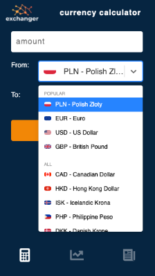
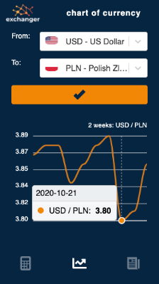
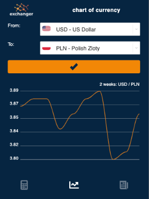
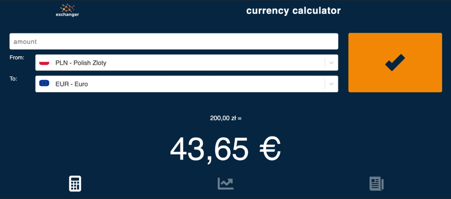
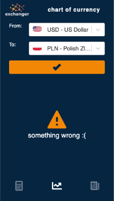

## EXCHANGER app vol. 2 by [@Maciekbe89](http://github.com/Maciekbe89)!

## Hello!

I present to you my new application. The Exchanger vol 2 is an app where you have 3 sections:

:dollar: currencies rate calculator (over 30 currencies to choose!),
:chart_with_upwards_trend: history of currencies rate - on special chart
:newspaper: current articles about financial sector.

All I created in [REACT JS](https://reactjs.org/) and [Styled-Component](https://styled-components.com/). All icons are from [Styled-Icons](https://styled-icons.js.org/). To the select input I used [React-Select](https://react-select.com/) and to the chart - [ApexCharts](https://apexcharts.com/).

It works well in multiple resolutions (mobile, tablet, desktop, portrait and landscape) :iphone: :computer:

I created special component for the all errors :x: and when we are waiting for a respond from API is component Loading with an animation :recycle:

## Thanks!
